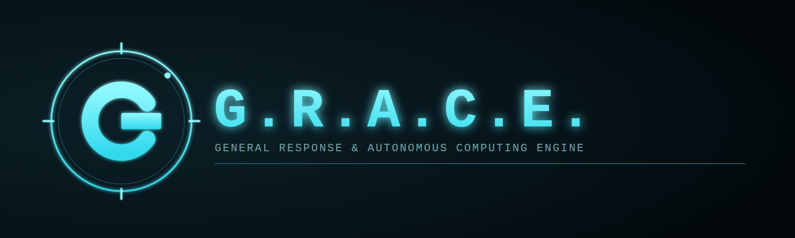

<p align="center">
  
</p>

*Even Dead, I'm The Hero* — a personal AI assistant inspired by Tony Stark's
system from *Spider-Man: Far From Home*. Runs in your browser with a live
camera feed, face recognition, voice commands, text-to-speech replies, and an
optional connection to a real LLM for open-ended conversation.

## Features

- **Voice recognition** — say the wake word "Edith" followed by a command
  (uses the browser's Web Speech API). Text input is always available as a
  fallback.
- **Camera / vision** — live webcam feed streamed to the backend for face
  detection and recognition (OpenCV, no GPU required).
- **Person recognition** — enroll people by name from a live camera frame;
  E.D.I.T.H. recognizes and labels them in the feed and can answer "who is
  that?" style questions.
- **Sighting log** — a running log of who's been seen and when, shown in the
  HUD.
- **Conversational core** — local rule-based answers for time/date/status,
  and (if you provide an `ANTHROPIC_API_KEY` or `GROQ_API_KEY`) full
  LLM-backed conversation via Claude or Groq.
- **Text-to-speech** — spoken replies via the browser's `speechSynthesis` API.
- **HUD-style interface** — dark sci-fi console with live optical feed,
  console/transcript panel, and status indicators.
- **Spotify control** (optional) — "Edith, pon musica de X", "pausa la
  musica", "siguiente cancion", "cancion anterior". Requires a Spotify
  Developer app and Premium — see [Spotify setup](#spotify-setup).

## Architecture

```
frontend/        Browser HUD (camera capture, mic, TTS, chat UI)
  index.html
  style.css
  app.js
backend/         FastAPI server
  main.py        REST + WebSocket endpoints, serves the frontend
  vision.py      Face detection/recognition (OpenCV Haar cascade + LBPH)
  brain.py       Command router + optional Claude/Groq API conversation
  logbook.py     Append-only sighting log
  spotify_client.py  Spotify OAuth + playback control (optional)
mobile/          Android app (Capacitor) — see mobile/README.md
data/
  known_faces/   Per-person face crops (created as you enroll people)
  logs/          Sighting log (JSONL)
  spotify_token.json  Spotify OAuth tokens (gitignored, created on login)
```

The camera and microphone are accessed by the browser (required for real
hardware access); the backend does face recognition on frames sent over a
WebSocket and handles the conversational logic.

## Setup

```bash
cd backend
python3 -m venv .venv && source .venv/bin/activate   # optional but recommended
pip install -r requirements.txt
cp ../.env.example ../.env   # then edit .env and add ANTHROPIC_API_KEY or GROQ_API_KEY (optional)
```

## Run

```bash
cd backend
uvicorn main:app --reload --host 0.0.0.0 --port 8000
```

Open `http://localhost:8000` in **Chrome** (the Web Speech API for voice
recognition is Chrome-only; camera/face-ID and text chat work in any modern
browser). Click **START SYSTEM** to grant camera access, then **MIC: ON** to
enable voice commands.

## Usage

- **Enroll a person**: type their name in the "Subject name" box and click
  **ENROLL FACE** while they're in frame. Repeat a few times from different
  angles for better recognition.
- **Voice command**: say "Edith, what time is it?" or "Edith, who do you
  see?".
- **Text command**: type into the console input and press SEND.
- **Full conversation**: set `ANTHROPIC_API_KEY` (Claude) or `GROQ_API_KEY`
  (Groq) in `.env` to let E.D.I.T.H. answer open-ended questions via an LLM
  instead of just local commands.

## Spotify setup

Optional. Lets E.D.I.T.H. actually control playback (not just open a link).
Requires **Spotify Premium** and at least one active device (the Spotify app
open somewhere — phone, PC, speaker).

1. Create an app at the
   [Spotify Developer Dashboard](https://developer.spotify.com/dashboard).
2. In the app's settings, add this exact Redirect URI:
   `http://127.0.0.1:8000/api/spotify/callback` (Spotify only allows plain
   HTTP for loopback redirects using the literal `127.0.0.1`, not
   `localhost`).
3. Copy the **Client ID** and **Client Secret** into `backend/.env`:
   ```
   SPOTIFY_CLIENT_ID=...
   SPOTIFY_CLIENT_SECRET=...
   ```
4. Restart the backend, then, **from a browser on the same PC running the
   server**, open `http://127.0.0.1:8000/api/spotify/login` and approve
   access. This is a one-time step — the server saves a refresh token to
   `data/spotify_token.json` (gitignored) and renews it automatically after
   that, so the phone app doesn't need to log in separately.
5. Try it: "Edith, pon musica de &lt;artist or song&gt;", "pausa la musica",
   "siguiente cancion", "cancion anterior".

## Using the app outside your home network

By default the phone app talks to the backend over your local WiFi (same
network as the PC running it). To use it from anywhere (mobile data, another
network), you need to expose the backend publicly and **lock it down first**:

1. **Set `EDITH_API_KEY`** in `backend/.env` to a long random string. Without
   this, anyone who finds your public URL can enroll/delete faces, chat
   (burning your LLM credits), and control your Spotify — the backend has no
   other authentication.
2. **Expose the backend** — the simplest option with no router configuration
   is a [Cloudflare Tunnel](https://developers.cloudflare.com/cloudflare-one/connections/connect-networks/get-started/):
   install `cloudflared`, then run
   ```
   cloudflared tunnel --url http://localhost:8000
   ```
   which prints a public `https://*.trycloudflare.com` URL that forwards to
   your local server (this quick-tunnel URL changes each time you restart
   `cloudflared`; a free Cloudflare account lets you set up a named tunnel
   with a permanent URL instead). Port-forwarding on your router works too
   but exposes your home IP directly — a tunnel is safer and easier.
3. In the app's **SERVIDOR** settings, set the server URL to that public
   `https://` URL, and the **API key** field to the same value as
   `EDITH_API_KEY`.

## Android app

There's also a native Android app in `mobile/` (Capacitor) that reuses this
HUD with native voice recognition and text-to-speech instead of the
browser's Web Speech API, so voice commands work outside Chrome too. It
connects to this same backend over the network — see `mobile/README.md` for
how to get a build.

## Notes

- No API key? E.D.I.T.H. still works — time, date, system status, and face
  identification are all handled locally.
- Face recognition uses OpenCV's LBPH recognizer, which is lightweight but
  less accurate than deep-learning face embeddings. Enroll multiple samples
  per person for best results.
- Nothing here controls physical hardware, drones, or weapons — this is an
  information/monitoring/conversation assistant only.
